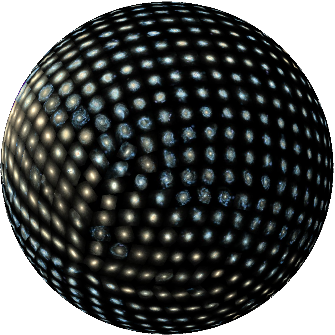

# Spherinator & HiPSter

`Spherinator` uses [PyTorch Lightning](https://lightning.ai/docs/pytorch/stable/) to implement a convolutional neural network (CNN) based variational autoencoder (VAE) with a spherical latent space.
`HiPSter` creates the HiPS tilings and the catalog which can be visualized interactively on the surface of a sphere with [Aladin Lite](https://github.com/cds-astro/aladin-lite).



```{toctree}
:maxdepth: 1
:caption: Introduction

training.md
hipster.md
```
